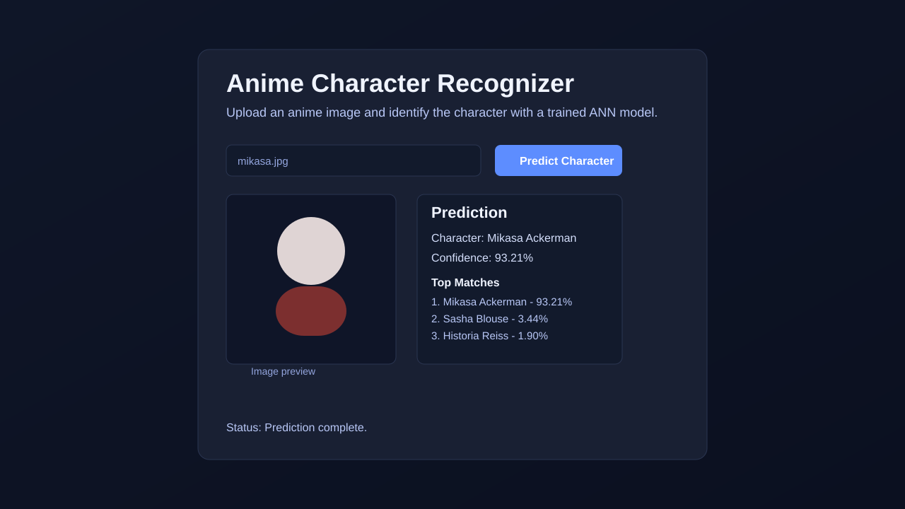

# Anime Character Recognizer

Anime Character Recognizer is a small AI project that predicts which anime character appears in an uploaded image.

It has two parts:

- `ai/`: training and inference code using a TensorFlow ANN model.
- `website/`: a Next.js + TypeScript single-page web app for image upload and prediction display.

## Screenshot



## Project Idea

1. Train an ANN model on anime face images, where each folder name is a character class.
2. Save trained model artifacts in `ai/artifacts/model`.
3. Upload an image in the website UI.
4. The website API route calls Python inference (`ai/predict_image.py`).
5. Return predicted character name, confidence, and top matches.

## Requirements

### System

- macOS/Linux/Windows
- Node.js 18+
- Python 3.10+ recommended for stable TensorFlow (your current setup may use Python 3.14 with `tf-nightly`)

### AI dependencies (`ai`)

From `ai/requirements.txt`:

- tensorflow
- numpy
- Pillow
- scikit-learn
- kagglehub
- opencv-python-headless

### Website dependencies (`website`)

- next
- react
- react-dom
- typescript
- @types/node
- @types/react
- @types/react-dom

## How To Run AI

From project root:

```bash
cd ai
python3 -m venv .venv
source .venv/bin/activate
pip install -r requirements.txt
```

Run single-image prediction:

```bash
python predict_image.py /absolute/path/to/image.jpg
```

Expected output is JSON with:

- `predicted_character`
- `confidence`
- `top_predictions`
- `face_bbox`

## How To Run Website

From project root:

```bash
cd website
npm install
npm run dev
```

Open:

- [http://localhost:3000](http://localhost:3000)

### Important Python setting for website inference

The website backend route executes `ai/predict_image.py`. If needed, point it to a specific Python environment:

```bash
PYTHON_EXECUTABLE=/absolute/path/to/python npm run dev
```

Use a Python environment that has `tensorflow`, `opencv-python-headless`, and `Pillow` installed.
